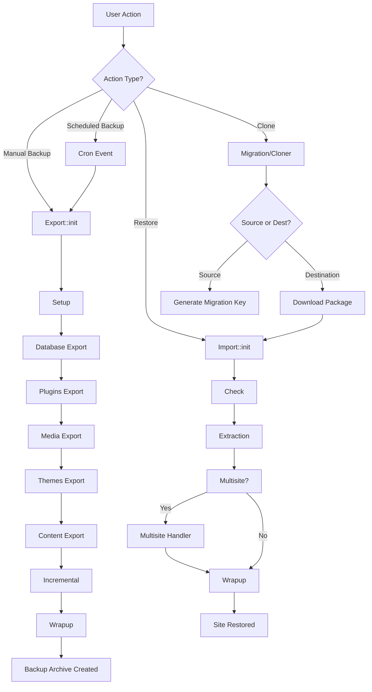

# Everest Backup - Developer Documentation

## Table of Contents
- [Overview](#overview)
- [Directory Structure](#directory-structure)
- [Core Functionality Locations](#core-functionality-locations)
  - [Backup Functionality](#backup-functionality)
  - [Restore Functionality](#restore-functionality)
  - [Clone/Migration Functionality](#clonemigration-functionality)
  - [Scheduled Backup (Cron)](#scheduled-backup-cron)
- [Architecture Overview](#architecture-overview)
- [Development Guidelines](#development-guidelines)
- [Common Tasks](#common-tasks)

---

## Overview

Everest Backup is a WordPress plugin that provides comprehensive backup, restore, clone, and scheduled backup functionality. The plugin follows a modular architecture with clear separation of concerns.

**Main Entry Point:** [`everest-backup.php`](file:///Users/n1tech/Local Sites/everest-backup/app/public/wp-content/plugins/everest-backup/everest-backup.php)

---

## Directory Structure

```
everest-backup/
├── assets/                  # Frontend assets (CSS, JS, images)
│   ├── css/                # Compiled CSS files
│   ├── js/                 # Compiled JavaScript files
│   ├── scss/               # SCSS source files
│   └── ts/                 # TypeScript source files
├── bash/                   # Bash scripts for backup operations
├── hbs/                    # Handlebars templates
├── inc/                    # Core PHP code (main development area)
│   ├── classes/           # Core classes
│   ├── core/              # Core export/import logic
│   │   ├── controllers/   # REST API controllers
│   │   ├── export/        # Export/backup implementation
│   │   └── import/        # Import/restore implementation
│   ├── modules/           # Feature modules
│   │   ├── backup/        # Backup module classes
│   │   ├── restore/       # Restore module classes
│   │   ├── migration-clone/ # Clone/migration classes
│   │   ├── cron/          # Scheduled backup handlers
│   │   ├── database/      # Database operations
│   │   ├── email/         # Email notifications
│   │   ├── history/       # Backup history management
│   │   ├── logs/          # Logging functionality
│   │   └── tabs/          # Admin UI tabs
│   ├── traits/            # Reusable PHP traits
│   ├── views/             # Admin UI templates
│   └── stats/             # Statistics and analytics
├── languages/             # Translation files
└── vendor/                # Composer dependencies
```

---

## Core Functionality Locations

### Backup Functionality

#### 🎯 Main Entry Points

**1. Core Export Orchestrator**
- **File:** [`inc/core/class-export.php`](file:///Users/n1tech/Local Sites/everest-backup/app/public/wp-content/plugins/everest-backup/inc/core/class-export.php)
- **Class:** `Everest_Backup\Core\Export`
- **Purpose:** Main orchestrator that coordinates the entire backup process
- **Key Method:** `Export::init($params)` - Initializes and manages the backup workflow

**Backup Process Flow:**
```
Setup → Database → Plugins → Media → Themes → Content → Incremental → Wrapup
```

**2. Backup Modules** (located in [`inc/modules/backup/`](file:///Users/n1tech/Local Sites/everest-backup/app/public/wp-content/plugins/everest-backup/inc/modules/backup/))

| Module | File | Purpose |
|--------|------|---------|
| **Database** | [`class-backup-database.php`](file:///Users/n1tech/Local Sites/everest-backup/app/public/wp-content/plugins/everest-backup/inc/modules/backup/class-backup-database.php) | Backs up WordPress database tables |
| **Plugins** | [`class-backup-plugins.php`](file:///Users/n1tech/Local Sites/everest-backup/app/public/wp-content/plugins/everest-backup/inc/modules/backup/class-backup-plugins.php) | Backs up installed plugins |
| **Themes** | [`class-backup-themes.php`](file:///Users/n1tech/Local Sites/everest-backup/app/public/wp-content/plugins/everest-backup/inc/modules/backup/class-backup-themes.php) | Backs up installed themes |
| **Uploads** | [`class-backup-uploads.php`](file:///Users/n1tech/Local Sites/everest-backup/app/public/wp-content/plugins/everest-backup/inc/modules/backup/class-backup-uploads.php) | Backs up media uploads |
| **Content** | [`class-backup-content.php`](file:///Users/n1tech/Local Sites/everest-backup/app/public/wp-content/plugins/everest-backup/inc/modules/backup/class-backup-content.php) | Backs up wp-content directory |
| **Config** | [`class-backup-config.php`](file:///Users/n1tech/Local Sites/everest-backup/app/public/wp-content/plugins/everest-backup/inc/modules/backup/class-backup-config.php) | Backs up configuration files |

**3. Export Implementation Classes** (located in [`inc/core/export/`](file:///Users/n1tech/Local Sites/everest-backup/app/public/wp-content/plugins/everest-backup/inc/core/export/))

| Class | File | Purpose |
|-------|------|---------|
| **Setup** | [`class-setup.php`](file:///Users/n1tech/Local Sites/everest-backup/app/public/wp-content/plugins/everest-backup/inc/core/export/class-setup.php) | Initializes backup environment and validates prerequisites |
| **Database** | [`class-database.php`](file:///Users/n1tech/Local Sites/everest-backup/app/public/wp-content/plugins/everest-backup/inc/core/export/class-database.php) | Database export implementation |
| **Plugins** | [`class-plugins.php`](file:///Users/n1tech/Local Sites/everest-backup/app/public/wp-content/plugins/everest-backup/inc/core/export/class-plugins.php) | Plugins export implementation |
| **Media** | [`class-media.php`](file:///Users/n1tech/Local Sites/everest-backup/app/public/wp-content/plugins/everest-backup/inc/core/export/class-media.php) | Media files export implementation |
| **Themes** | [`class-themes.php`](file:///Users/n1tech/Local Sites/everest-backup/app/public/wp-content/plugins/everest-backup/inc/core/export/class-themes.php) | Themes export implementation |
| **Contents** | [`class-content.php`](file:///Users/n1tech/Local Sites/everest-backup/app/public/wp-content/plugins/everest-backup/inc/core/export/class-content.php) | Content export implementation |
| **Incremental** | [`class-incremental.php`](file:///Users/n1tech/Local Sites/everest-backup/app/public/wp-content/plugins/everest-backup/inc/core/export/class-incremental.php) | Incremental backup support |
| **Wrapup** | [`class-wrapup.php`](file:///Users/n1tech/Local Sites/everest-backup/app/public/wp-content/plugins/everest-backup/inc/core/export/class-wrapup.php) | Finalizes backup, creates archive, generates metadata |

**4. REST API Controllers**
- **Manual Backup:** [`inc/core/controllers/v1/class-manual-backup-controller.php`](file:///Users/n1tech/Local Sites/everest-backup/app/public/wp-content/plugins/everest-backup/inc/core/controllers/v1/class-manual-backup-controller.php)
- **Schedule Backup:** [`inc/core/controllers/v1/class-schedule-backup-controller.php`](file:///Users/n1tech/Local Sites/everest-backup/app/public/wp-content/plugins/everest-backup/inc/core/controllers/v1/class-schedule-backup-controller.php)

**5. Admin UI**
- **Manual Backup View:** [`inc/views/backup/manual-backup.php`](file:///Users/n1tech/Local Sites/everest-backup/app/public/wp-content/plugins/everest-backup/inc/views/backup/manual-backup.php)
- **Schedule Backup View:** [`inc/views/backup/schedule-backup.php`](file:///Users/n1tech/Local Sites/everest-backup/app/public/wp-content/plugins/everest-backup/inc/views/backup/schedule-backup.php)
- **Backup Tab:** [`inc/modules/tabs/class-backup-tab.php`](file:///Users/n1tech/Local Sites/everest-backup/app/public/wp-content/plugins/everest-backup/inc/modules/tabs/class-backup-tab.php)

---

### Restore Functionality

#### 🎯 Main Entry Points

**1. Core Import Orchestrator**
- **File:** [`inc/core/class-import.php`](file:///Users/n1tech/Local Sites/everest-backup/app/public/wp-content/plugins/everest-backup/inc/core/class-import.php)
- **Class:** `Everest_Backup\Core\Import`
- **Purpose:** Main orchestrator that coordinates the entire restore process
- **Key Method:** `Import::init($params)` - Initializes and manages the restore workflow

**Restore Process Flow:**
```
Check → Extraction → Multisite (if applicable) → Wrapup
```

**2. Restore Modules** (located in [`inc/modules/restore/`](file:///Users/n1tech/Local Sites/everest-backup/app/public/wp-content/plugins/everest-backup/inc/modules/restore/))

| Module | File | Purpose |
|--------|------|---------|
| **Database** | [`class-restore-database.php`](file:///Users/n1tech/Local Sites/everest-backup/app/public/wp-content/plugins/everest-backup/inc/modules/restore/class-restore-database.php) | Restores database tables |
| **Plugins** | [`class-restore-plugins.php`](file:///Users/n1tech/Local Sites/everest-backup/app/public/wp-content/plugins/everest-backup/inc/modules/restore/class-restore-plugins.php) | Restores plugins |
| **Themes** | [`class-restore-themes.php`](file:///Users/n1tech/Local Sites/everest-backup/app/public/wp-content/plugins/everest-backup/inc/modules/restore/class-restore-themes.php) | Restores themes |
| **Uploads** | [`class-restore-uploads.php`](file:///Users/n1tech/Local Sites/everest-backup/app/public/wp-content/plugins/everest-backup/inc/modules/restore/class-restore-uploads.php) | Restores media uploads |
| **Content** | [`class-restore-content.php`](file:///Users/n1tech/Local Sites/everest-backup/app/public/wp-content/plugins/everest-backup/inc/modules/restore/class-restore-content.php) | Restores wp-content |
| **Config** | [`class-restore-config.php`](file:///Users/n1tech/Local Sites/everest-backup/app/public/wp-content/plugins/everest-backup/inc/modules/restore/class-restore-config.php) | Restores configuration files |
| **Users** | [`class-restore-users.php`](file:///Users/n1tech/Local Sites/everest-backup/app/public/wp-content/plugins/everest-backup/inc/modules/restore/class-restore-users.php) | Handles user restoration |
| **Multisite** | [`class-restore-multisite.php`](file:///Users/n1tech/Local Sites/everest-backup/app/public/wp-content/plugins/everest-backup/inc/modules/restore/class-restore-multisite.php) | Handles multisite-specific restoration |

**3. Import Implementation Classes** (located in [`inc/core/import/`](file:///Users/n1tech/Local Sites/everest-backup/app/public/wp-content/plugins/everest-backup/inc/core/import/))

| Class | File | Purpose |
|-------|------|---------|
| **Check** | [`class-check.php`](file:///Users/n1tech/Local Sites/everest-backup/app/public/wp-content/plugins/everest-backup/inc/core/import/class-check.php) | Validates backup file and prerequisites |
| **Extraction** | [`class-extraction.php`](file:///Users/n1tech/Local Sites/everest-backup/app/public/wp-content/plugins/everest-backup/inc/core/import/class-extraction.php) | Extracts backup archive |
| **Multisite** | [`class-multisite.php`](file:///Users/n1tech/Local Sites/everest-backup/app/public/wp-content/plugins/everest-backup/inc/core/import/class-multisite.php) | Handles multisite-specific imports |
| **Wrapup** | [`class-wrapup.php`](file:///Users/n1tech/Local Sites/everest-backup/app/public/wp-content/plugins/everest-backup/inc/core/import/class-wrapup.php) | Finalizes restore process, cleanup |

**4. Admin UI**
- **Restore Views:** [`inc/views/restore/`](file:///Users/n1tech/Local Sites/everest-backup/app/public/wp-content/plugins/everest-backup/inc/views/restore/)
- **Restore Tab:** [`inc/modules/tabs/class-restore-tab.php`](file:///Users/n1tech/Local Sites/everest-backup/app/public/wp-content/plugins/everest-backup/inc/modules/tabs/class-restore-tab.php)

---

### Clone/Migration Functionality

#### 🎯 Main Entry Points

**1. Base Migration/Clone Class**
- **File:** [`inc/classes/class-migration-clone.php`](file:///Users/n1tech/Local Sites/everest-backup/app/public/wp-content/plugins/everest-backup/inc/classes/class-migration-clone.php)
- **Class:** `Everest_Backup\Migration_Clone`
- **Purpose:** Base class providing shared functionality for migration and cloning

**2. Migration Module** (Source Site)
- **File:** [`inc/modules/migration-clone/class-migration.php`](file:///Users/n1tech/Local Sites/everest-backup/app/public/wp-content/plugins/everest-backup/inc/modules/migration-clone/class-migration.php)
- **Class:** `Everest_Backup\Modules\Migration`
- **Purpose:** Generates migration keys for transferring site to another location
- **Key Methods:**
  - `__construct($args)` - Initializes migration with backup file
  - `get_url()` - Returns migration page URL with key
  - `get_migration_key()` - Generates encrypted migration key

**3. Cloner Module** (Destination Site)
- **File:** [`inc/modules/migration-clone/class-cloner.php`](file:///Users/n1tech/Local Sites/everest-backup/app/public/wp-content/plugins/everest-backup/inc/modules/migration-clone/class-cloner.php)
- **Class:** `Everest_Backup\Modules\Cloner`
- **Purpose:** Handles cloning from migration key on destination site
- **Key Methods:**
  - `handle_migration_key()` - Validates and processes migration key
  - `is_clonable()` - Validates if clone operation is possible
  - `download_package($args)` - Downloads backup from source site
  - `is_same_site($key_info)` - Prevents cloning to same site

**Clone Process Flow:**
```
Source Site: Create Backup → Generate Migration Key
Destination Site: Enter Migration Key → Validate → Download Package → Restore
```

**4. Admin UI**
- **Migration View:** [`inc/views/migration-clone/migration.php`](file:///Users/n1tech/Local Sites/everest-backup/app/public/wp-content/plugins/everest-backup/inc/views/migration-clone/migration.php)
- **Migration/Clone Tab:** [`inc/modules/tabs/class-migration-clone-tab.php`](file:///Users/n1tech/Local Sites/everest-backup/app/public/wp-content/plugins/everest-backup/inc/modules/tabs/class-migration-clone-tab.php)

---

### Scheduled Backup (Cron)

#### 🎯 Main Entry Points

**1. Base Cron Class**
- **File:** [`inc/classes/class-cron.php`](file:///Users/n1tech/Local Sites/everest-backup/app/public/wp-content/plugins/everest-backup/inc/classes/class-cron.php)
- **Class:** `Everest_Backup\Cron`
- **Purpose:** Base class for managing WordPress cron jobs
- **Key Methods:**
  - `schedule_events()` - Schedules backup cron events
  - `unschedule_events()` - Removes scheduled events
  - `cron_event_timestamp($interval, $schedule_backup)` - Calculates next run time
  - `add_cron_intervals($schedules)` - Registers custom cron intervals

**2. Cron Handler**
- **File:** [`inc/modules/cron/class-cron-handler.php`](file:///Users/n1tech/Local Sites/everest-backup/app/public/wp-content/plugins/everest-backup/inc/modules/cron/class-cron-handler.php)
- **Class:** `Everest_Backup\Modules\Cron_Handler`
- **Purpose:** Implements custom cron schedules
- **Key Method:** `cron_schedules()` - Defines available backup schedules

**3. Cron Actions**
- **File:** [`inc/modules/cron/class-cron-actions.php`](file:///Users/n1tech/Local Sites/everest-backup/app/public/wp-content/plugins/everest-backup/inc/modules/cron/class-cron-actions.php)
- **Purpose:** Defines actions triggered by cron events

**Available Cron Schedules:**
The plugin supports various backup frequencies (defined in `everest_backup_cron_cycles()` function):
- Hourly
- Twice Daily
- Daily
- Weekly
- Monthly
- Custom intervals

**4. Schedule Configuration**
- **Settings:** Stored in WordPress options under `everest_backup_settings['schedule_backup']`
- **Key Settings:**
  - `enable` - Enable/disable scheduled backups
  - `cron_cycle` - Selected backup frequency
  - `cron_cycle_time` - Time of day to run backup
  - `save_to` - Backup destination (local, cloud storage)
  - `delete_from_server` - Auto-delete after cloud upload

**5. Admin UI**
- **Schedule Backup View:** [`inc/views/backup/schedule-backup.php`](file:///Users/n1tech/Local Sites/everest-backup/app/public/wp-content/plugins/everest-backup/inc/views/backup/schedule-backup.php)
- **Schedule Backup Controller:** [`inc/core/controllers/v1/class-schedule-backup-controller.php`](file:///Users/n1tech/Local Sites/everest-backup/app/public/wp-content/plugins/everest-backup/inc/core/controllers/v1/class-schedule-backup-controller.php)

---

## Architecture Overview

### Process Flow Architecture



### Class Hierarchy

```
Everest_Backup (Main Plugin Class)
├── Core
│   ├── Export (Backup Orchestrator)
│   │   ├── Setup
│   │   ├── Database
│   │   ├── Plugins
│   │   ├── Media
│   │   ├── Themes
│   │   ├── Contents
│   │   ├── Incremental
│   │   └── Wrapup
│   └── Import (Restore Orchestrator)
│       ├── Check
│       ├── Extraction
│       ├── Multisite
│       └── Wrapup
├── Modules
│   ├── Backup (Individual backup handlers)
│   ├── Restore (Individual restore handlers)
│   ├── Migration (Source site)
│   ├── Cloner (Destination site)
│   └── Cron_Handler (Scheduled backups)
└── Classes
    ├── Cron (Base cron functionality)
    ├── Migration_Clone (Base migration/clone)
    └── AJAX (AJAX handlers)
```

---

## Development Guidelines

### Adding a New Backup Component

1. **Create Module Class** in `inc/modules/backup/`
   ```php
   namespace Everest_Backup\Modules;

   class Backup_YourComponent {
       public function init() {
           // Backup logic
       }
   }
   ```

2. **Create Export Implementation** in `inc/core/export/`
   ```php
   namespace Everest_Backup\Core\Export;

   class YourComponent {
       public static function init($params) {
           // Export orchestration
       }
   }
   ```

3. **Register in Export Flow** in `inc/core/class-export.php`
   ```php
   case 'yourcomponent':
       YourComponent::init($params);
       break;
   ```

### Adding a New Restore Component

1. **Create Module Class** in `inc/modules/restore/`
2. **Create Import Implementation** in `inc/core/import/`
3. **Register in Import Flow** in `inc/core/class-import.php`

### Working with Cron Schedules

**Add a new cron interval:**
```php
// In inc/modules/cron/class-cron-handler.php
protected function cron_schedules() {
    return array(
        'everest_backup_custom' => array(
            'interval' => 3600, // seconds
            'display' => __('Custom Interval', 'everest-backup')
        )
    );
}
```

**Hook into cron event:**
```php
add_action('everest_backup_custom_hook', 'your_backup_function');
```

---

## Common Tasks

### 🔍 Finding Where Backup Happens

**Quick Reference:**
1. **Entry Point:** `inc/core/class-export.php` → `Export::init()`
2. **Process Steps:** `inc/core/export/class-*.php` (setup, database, plugins, etc.)
3. **Individual Handlers:** `inc/modules/backup/class-backup-*.php`

### 🔍 Finding Where Restore Happens

**Quick Reference:**
1. **Entry Point:** `inc/core/class-import.php` → `Import::init()`
2. **Process Steps:** `inc/core/import/class-*.php` (check, extraction, wrapup)
3. **Individual Handlers:** `inc/modules/restore/class-restore-*.php`

### 🔍 Finding Where Clone Happens

**Quick Reference:**
1. **Source Site:** `inc/modules/migration-clone/class-migration.php`
2. **Destination Site:** `inc/modules/migration-clone/class-cloner.php`
3. **Base Logic:** `inc/classes/class-migration-clone.php`

### 🔍 Finding Where Scheduled Backups Happen

**Quick Reference:**
1. **Cron Base:** `inc/classes/class-cron.php`
2. **Cron Handler:** `inc/modules/cron/class-cron-handler.php`
3. **Cron Actions:** `inc/modules/cron/class-cron-actions.php`
4. **Settings UI:** `inc/views/backup/schedule-backup.php`

### 🔧 Debugging Tips

**Enable Debug Logging:**
```php
// In wp-config.php
define('EVEREST_BACKUP_DEBUG', true);
```

**Check Process Status:**
```php
$procstat = Everest_Backup\Logs::get_proc_stat();
```

**View Logs:**
- Logs are stored in the backup directory
- Check `inc/modules/logs/` for log handling classes

### 📝 Code Standards

- Follow WordPress Coding Standards
- Use proper namespacing: `Everest_Backup\Module\ClassName`
- Add PHPDoc comments for all classes and methods
- Use translation functions for user-facing strings

---

## Key Files Quick Reference

| Functionality | Primary File | Secondary Files |
|--------------|--------------|-----------------|
| **Backup** | `inc/core/class-export.php` | `inc/core/export/*.php`, `inc/modules/backup/*.php` |
| **Restore** | `inc/core/class-import.php` | `inc/core/import/*.php`, `inc/modules/restore/*.php` |
| **Clone** | `inc/modules/migration-clone/class-cloner.php` | `inc/modules/migration-clone/class-migration.php` |
| **Schedule** | `inc/classes/class-cron.php` | `inc/modules/cron/*.php` |
| **AJAX** | `inc/classes/class-ajax.php` | - |
| **REST API** | `inc/core/class-api.php` | `inc/core/controllers/v1/*.php` |
| **Admin UI** | `inc/classes/class-admin-menu.php` | `inc/views/**/*.php` |
| **History** | `inc/modules/history/class-history-table.php` | - |

---

## Additional Resources

- **Main Plugin File:** [`everest-backup.php`](file:///Users/n1tech/Local Sites/everest-backup/app/public/wp-content/plugins/everest-backup/everest-backup.php)
- **Functions:** [`inc/functions.php`](file:///Users/n1tech/Local Sites/everest-backup/app/public/wp-content/plugins/everest-backup/inc/functions.php) - Helper functions
- **Traits:** [`inc/traits/`](file:///Users/n1tech/Local Sites/everest-backup/app/public/wp-content/plugins/everest-backup/inc/traits/) - Reusable code patterns
- **Build Script:** [`build.js`](file:///Users/n1tech/Local Sites/everest-backup/app/public/wp-content/plugins/everest-backup/build.js) - Asset compilation

---

**Last Updated:** 2025-12-01
**Plugin Version:** Check `everest-backup.php` for current version
